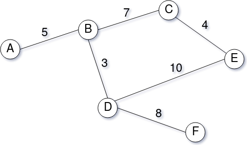

# Processo Seletivo Vagas - Engenheiro(a) de Software

## Recrutando candidatos

Um recrutador precisa analisar as candidaturas recebidas para vagas de emprego. Dado o grande volume de candidaturas em algumas vagas, olhar um a um seria um trabalho muito demorado.

Seu papel aqui é ajudar o recrutador, indicando as pessoas mais aderentes para cada vaga. Para isso, crie uma API de acordo com as especificações a seguir.

### Especificações da API

Considerações gerais:

* **Níveis de experiência**:
  * **1**: estagiário
  * **2**: júnior
  * **3**: pleno
  * **4**: sênior
  * **5**: especialista
* **Localidades**: representadas por letras do alfabeto. Verificar no mapa abaixo os caminhos e distâncias entre as localidades.



* ***Score* do candidato**: cada candidato deverá receber um *score* para cada candidatura que realizar. Esse *score* é definido com base no nível de experiência e localização em relação a vaga a qual se candidatou.


##### Cálculo do *score* do candidato

O *score* do candidato é dado pela seguinte fórmula:


*N* é definido por:


onde:

* *NV* é o nível de experiência esperado para a vaga 
* *NC* é o nível de experiência do candidato

Para definir o valor de *D*,  encontre a **menor distância entre o candidato e a vaga** e utilize este valor para consultar a tabela a seguir:

| Menor distância entre o candidato e a vaga | *D*  |
| ------------------------------------------ | ---- |
| 0 até 5                                    | 100  |
| maiores que 5 até 10                       | 75   |
| maiores que 10 até 15                      | 50   |
| maiores que 15 até 20                      | 25   |
| maiores que 20                             | 0    |


Considere somente a parte inteira do *score*.

**Não utilize bibliotecas para a realização do cálculo da distância**. 


#### Endpoints

##### 1. Criar um endpoint para cadastrar vagas de emprego

**Request:** 

```POST http://localhost:9000/v1/vagas```

+ Body:

```json
{
    "empresa": "Teste",
    "titulo": "Vaga teste",
    "descricao": "Criar os mais diferentes tipos de teste",
    "localizacao": "A",
    "nivel": 3
}
```

**Response:**

O response para esta função será definido por você e **faz parte da avaliação**.

##### 2. Criar um endpoint para cadastrar pessoas

**Request:** 

```POST http://localhost:9000/v1/pessoas```

+ Body:

```json
{
    "nome": "John Doe",
    "profissao": "Engenheiro de Software",
    "localizacao": "C",
    "nivel": 2
}
```

**Response:**

O response para esta função será definido por você e **faz parte da avaliação**.

##### 3. Registrar candidatura de uma pessoa em uma vaga

Neste endpoint você deverá registar a candidatura do candidato para a vaga em questão.

**Request:** 

```POST http://localhost:9000/v1/candidaturas```

+ Body:

```json
{
    "id_vaga": 1,
    "id_pessoa": 2
}
```

**Response:**

O response para esta função será definido por você e **faz parte da avaliação**.

##### 4. Criar um endpoint para retornar os candidatos de uma vaga, ordenados pelo score (de forma decrescente)

**GET:** `http://localhost:9000/v1/vagas/1/candidaturas/ranking`

**Response:**

```json
[
    {
        "nome": "Mary Jane",
        "profissao": "Engenheira de Software",
        "localizacao": "A",
        "nivel": 4,
        "score": 100
	},
    {
        "nome": "John Doe",
        "profissao": "Engenheiro de Software",
        "localizacao": "C",
        "nivel": 2,
        "score": 85
	},
    ...
]
```

